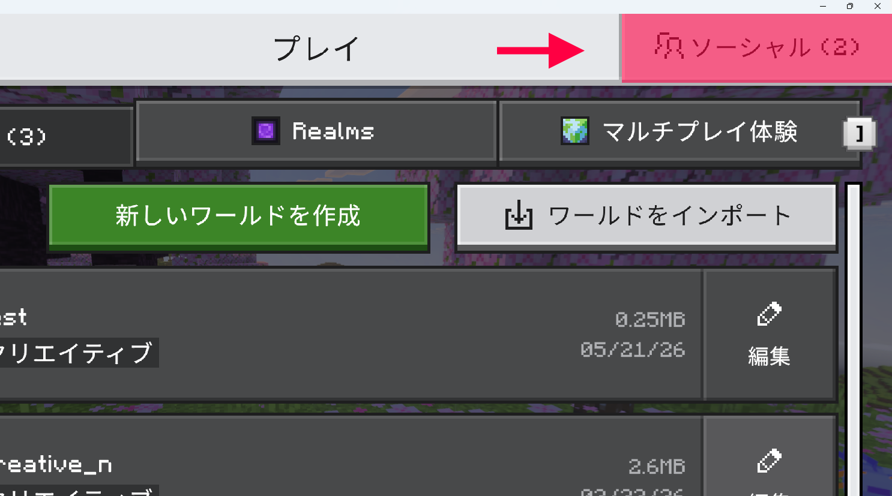
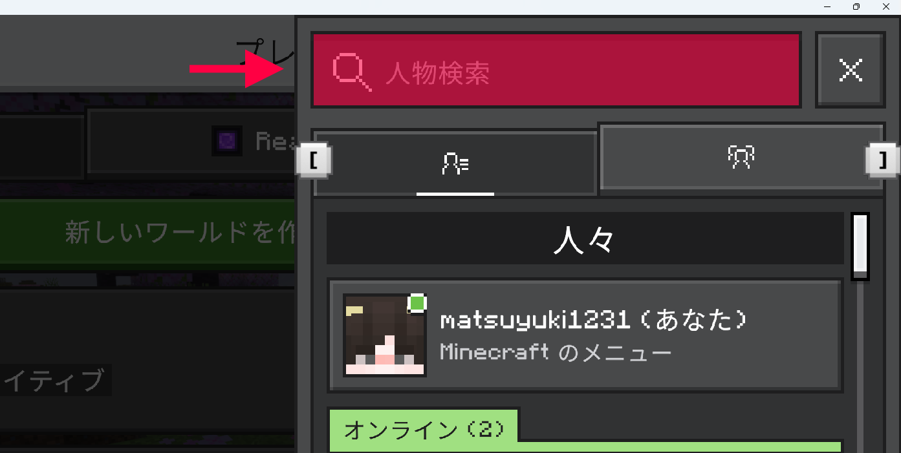
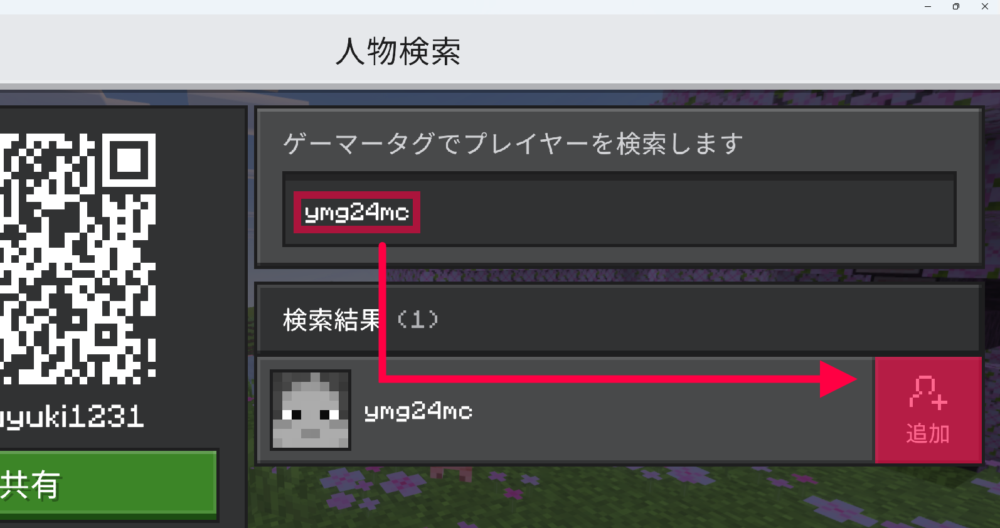
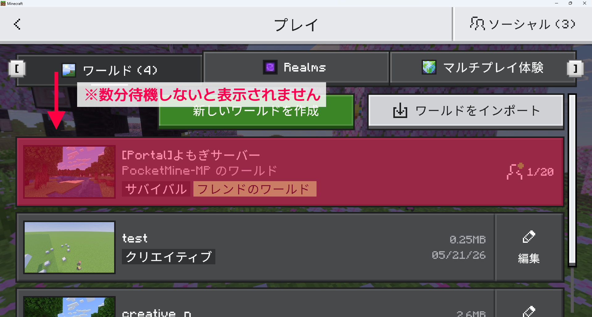
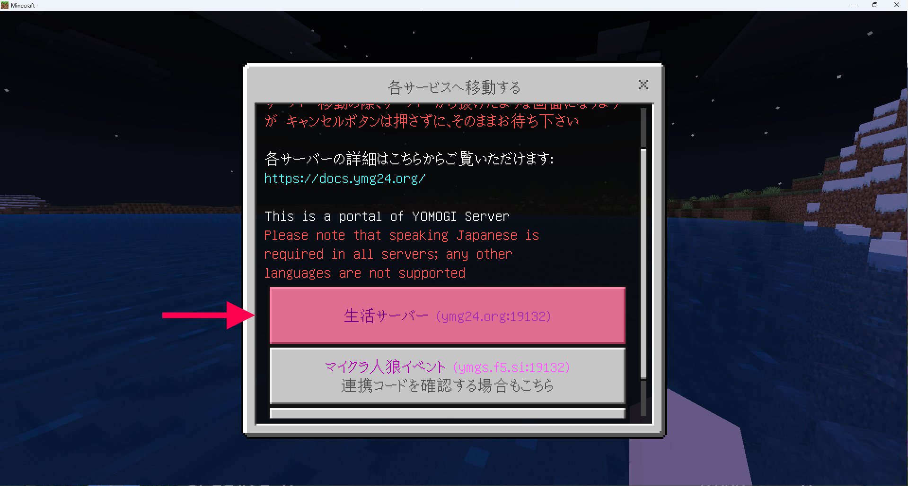

# フレンド追加で参加する

専用のゲーマータグをフレンド追加することによる生活サーバーの参加方法について説明します。

:::tip このページの要約
「ymg24mc」をフレンド追加すると、生活サーバーとマイクラ人狼イベントの両方に参加できますが、少し不安定です
:::

:::info この方法のメリット
 - Nintendo Switchの方でも、本体設定を変更することなく参加できます
 - 一回のフレンド追加で、生活サーバーとマイクラ人狼イベントの両方に参加できます
:::

:::caution この方法のデメリット
- 参加までに複数のサーバーを経由するため、接続が不安定になりやすいです
- 特に、ポータルサーバーが停止している場合は参加できません
- 生活サーバーに参加するために毎回ボタンを押す必要があるため、少々手間がかかります
:::

## Minecraftサーバーに参加する

➀ Minecraftの統合版を起動し、「プレイ」をクリックします  
② 画面右上の「ソーシャル」をクリックします  

③ 「人物検索」をクリックします  

③ 入力欄に「ymg24mc」と入力します  
④ 検索結果右側の「追加」をクリックします  

⑤ Minecraftを再起動し、2分ほど待機します  
⑥ ワールド一覧に表示されている「よもぎサーバー」を選択します　　

:::caution 注意
サーバーに参加できない場合は https://docs.ymg24.org/docs/living/faq/joining-faults をご覧いただくか、[サーバーアドレスによる参加](https://docs.ymg24.org/docs/living/how-to-join/join-with-address)をご検討ください。  
  :::

⑦ 「生活サーバー」を選択します　　

