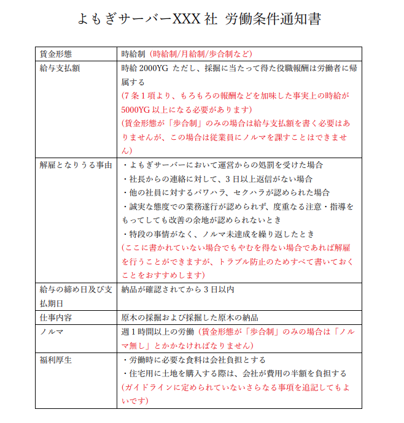

# 公認企業制度

よもぎサーバーでは、会社プラグインを使用して設立された会社のうち、特にステークホルダー(社員や取引先)に対する配慮と持続的な成長を重要視している会社を「優良企業」とし、申請のあった優良企業に支援金や宣伝支援を行う制度(公認企業制度)を設けています。  
公認企業になると就職企業者にアピールができるほか、運営から各種支援を受けることができます。

# 優良企業と公認企業の違い

「よもぎ第2期生活鯖_優良企業ガイドライン」を継続的に遵守している企業が「優良企業」であり、優良企業のうち特にDiscordの #会社申請 チャンネルで申請を行い、運営からの支援金や宣伝支援の対象となった企業が「公認企業」です。

# 公認企業になるメリット

・月30000YGの支援金が受け取れます(2か月に1度60000YGを支給)  
・生活サーバー内で5分おきに流れる定期メッセージに自社の宣伝文を載せることができます

# 公認企業になるためには

➀「よもぎ第2期生活鯖_優良企業ガイドライン」を遵守します  
なお、ガイドラインの原文は[こちら](https://docs.ymg24.org/docs/tos/good-standing-company-guideline)からご覧いただけるほか、このページの下部でも解説をしています。  
②よもぎサーバー公式Discord内の「#会社申請」チャンネルで公認企業になるための申請を行います  
③運営による審査を通過すると公認企業となります  

なお、申請に当たり、いくつか運営からお伺いする点がある可能性があります。

# 優良企業ガイドライン

:::info
第1条では、基本的な用語の定義を行っています。
:::

> ### 1. 用語の定義
> **1.1** 「よもぎ第2期生活鯖」とは、私たちが提供するマインクラフトサーバーのうち、2025年3月22日から提供を開始している生活サーバーを意味します。  
**1.2** 「企業」とは、よもぎ第2期生活鯖内で/company searchコマンドを使用して検索が可能な、プラグイン上にデータとして存在する会社を意味します。  
**1.3** 「優良企業」とは、当ガイドラインの内容を遵守した企業を意味します。  
**1.4** 「運営」とは、よもぎ第2期生活鯖の運営を意味します。これは、全体・個人を問いません。  
**1.5** 「公認企業」とは、優良企業であり、なおかつ別途定める方法により認定申請を行い、運営により認可された企業を意味します。  
**1.6** 「ユーザー」とは、利用規約に則り、よもぎ第2期生活鯖のサービスを受ける人を意味します。  
**1.7** 「新規ユーザー」とは、「ユーザー」のうち、特に直近1か月より前によもぎ第2期生活鯖に参加したことがない人を意味します。  
**1.8** 「個人情報」とは、ユーザー及び運営個人の、個人を特定できる情報を意味します。これは、だれか一人の情報であるか、若しくは複数人の情報であるかを問いません。  

:::info
第2条では、「公認企業はこのガイドラインを守らないといけない」ということが定められています。
:::

> ### 2. 当ガイドラインについて
> 
> 当ガイドラインは、公認企業として認可されるために企業が遵守する必要のある内容について定めます。  
公認企業として認可される全企業は、当ガイドラインを継続的に遵守し、優良企業に位置し続ける必要があります。  
ただし、公認企業ではない企業がこのガイドラインを遵守しない場合でも、別途定める利用規約、Minecraft規約、Discord規約に違反しない場合、直ちに処分や不利益を被ることはありません。  

:::info
第3条では、「優良企業は労働条件通知書を作らないといけない」ということが定められています。  
・労働条件通知書には、「賃金形態」「給与支払額(歩合制の場合は不要)」「解雇となりうる事由」「給与の締め日及び支払期日」「仕事内容」「ノルマ」を書く必要があります  
・労働条件通知書は社員と運営が見える場所に保存しておく必要があります
:::
:::tip
労働条件通知書の例です。

:::
:::tip
現実世界では労働条件通知書は社員ごとに交付しなければいけませんが、よもぎサーバー内では一つの労働条件通知書を使いまわしても構いません。
:::

> ### 3. 労働条件通知書の作成にかかる事項
> 
> 優良企業は、社員を雇用するにあたって「労働条件通知書」を作成する必要があります。この際、以下の事項を遵守してください。  
**3.1** 「労働条件通知書」は、文書で記述してください。  
**3.2** 作成された「労働条件通知書」は、労働者および運営が容易に閲覧できるようにする必要があります。  
**3.3** 「労働条件通知書」を保存するにあたり、使用する媒体は問いません。例としてDiscordチャンネルのチャット、txtファイル、pdfファイル、企業のwebサイトが挙げられますが、この限りではありません。  
**3.4** 「労働条件通知書」には、「賃金形態」を明記してください。「賃金形態」の例として、時給制、日給制、月給制、歩合制が挙げられますが、この限りではありません。  
**3.5** 「賃金形態」は、複数の形態を併用することができます。  
**3.6** 「労働条件通知書」には、「給与支払額」を明記してください。  
**3.7** 「給与支払額」の単位は「YG」としてください。  
**3.8** 3.4の規定によらず、「賃金形態」が「歩合制」のみの場合は労働条件通知書に給与支払額を明記する必要はありません。ただしこの場合、社員に「ノルマ」を課してはなりません。  
**3.9** 「労働条件通知書」には、「解雇となりうる事由」を明記してください。ただし、会社が解雇を全く行わない場合は明記の必要はありませんが、明記しないことは推奨されません。  
**3.10** 「労働条件通知書」には、「給与の締め日及び支払期日」を明記してください。「給与の締め日及び支払期日」の例として「月末締め翌月25日払い」「成果達成後3日以内」などが挙げられますが、この限りではありません。  
**3.11** 「労働条件通知書」には、「仕事内容」を明記してください。「仕事内容」の例として「資材集め」「建築」などが挙げられますが、この限りではありません。  
**3.12** 「労働条件通知書」には、「ノルマ」を明記してください。「ノルマ」の例として、「週2時間以上の労働」「週5st以上の原木納品」などが挙げられますが、この限りではありません。「ノルマ」を課さない場合は「ノルマ無し」と明記してください。  
**3.13** 「ノルマ」を「週3時間」以上、または事実上週3時間以上の労働が必要な程度にしてはいけません。  
**3.14** 「労働条件通知書」は、募集する職種により複数種類作成しても構いません。  
**3.15** 「労働条件通知書」を更新する場合のうち、社員が不利になる変更(不利益変更)を行う場合は、あらかじめ社員との合意を行う必要があります。  
**3.16** 「労働条件通知書」は、公営企業となることの審査を行う際、および運営から指示があった場合は、運営に提示する必要があります。  
**3.17** 新たな社員を雇い入れる際は、採用試験(面接など)の合格後から入社までの期間に、社員となる予定の者に「労働条件通知書」を提示してください。労働条件通知書を閲覧した社員となる予定の者が入社を辞退する場合、企業はこれを拒否してはいけません。  
**3.18** 3.17の規定により社員となる予定の者に「労働条件通知書」を提示する際、社員となる予定の者が「労働条件通知書のスクリーンショットを撮ること」を求めた場合、企業はこれを拒否してはいけません。  

:::info
第4条では、「給与はしっかりと払わなければならない」ということが定められています。  
・給与は「YG」で支払う必要があります
:::

> ### 4. 給与の支払いにかかる事項
> 
> 優良企業は、社員に給与を支払うにあたって、以下の事項を遵守してください。  
**4.1** 給与支払額は、「労働条件通知書」で定めた額に満たない額となってはいけません。  
**4.2** 「給与支払額」で定められた額より高い額を支払う場合は、その超過分を翌支払期日に支払うべき給与から差し引くことはできません。  
**4.2** 給与はYGで支払ってください。  
**4.3** 「労働条件通知書」で定めた「給与の締め日及び支払期日」を遵守してください。  

:::info
第5条では、社員や就職希望者に対する禁止事項が定められています。  
・社員が業務中に出した損害は基本的に会社負担です  
・社員の退職願を拒否してはいけません  
・社員以外の人が自社のDiscordサーバーを抜けることを制限してはいけません  
・社員の副業は認めましょう  
・業務に必要なツール代などは会社負担です  
・パワハラ/セクハラ/不当解雇をしてはいけません  
:::

> ### 5. 雇用上の禁止事項
> 
> 優良企業は、企業として活動するにあたって、以下の事項を遵守してください。  
**5.1** 社員が会社に損害を与えた場合、その原因が故意または重過失に因らないときは、社員にその損害を請求してはいけません。  
**5.2** 社員が自己都合退職を希望する場合、理由のいかんにかかわらず企業はこれを拒否してはいけません。  
**5.3** 社員以外のユーザーが自社のDiscordサーバーを脱退する場合、理由のいかんにかかわらず企業はこれを拒否してはいけません。  
**5.4** 企業が社員を解雇する際、その事由が社会通念上相当ではなく、なおかつ「労働条件通知書」で定めた「解雇となりうる事由」以外の事由である場合は、社員を解雇してはいけません。  
**5.5** 企業は社員に、社員自身の個人情報の開示を義務付けてはいけません。  
**5.6** 企業は社員が副業を行うことを禁止してはいけません。  
**5.7** 企業は、社員に対し「労働条件通知書」で定めた「仕事内容」にあたらない業務を指示し、社員がその業務の遂行を拒否した場合、企業はその拒否を拒否してはいけません。  
**5.8** 企業は、社員が業務を遂行するに当たって必要となる費用(ツール代など)を社員に負担させてはいけません。  
**5.9** 社員に対しパワハラ、セクハラをしてはいけません。  

:::info
第6条では、採用試験にかかわる事項が定められています 
・面接は敬語でやりましょう  
・パワハラ/セクハラ/新規差別をしてはいけません  
・結果は合否にかかわらず伝えましょう。いつ伝えるかは面接終了時に言いましょう
:::

> ### 6. 採用試験にかかる事項
> 
> 優良企業は、新たな社員を雇い入れる際に行う採用試験において、以下の事項を遵守してください。  
**6.1** ため口を使って面接をしてはいけません。  
**6.2** 就職希望者に個人情報の開示を要求してはいけません。ただし、活動可能時間や活動可能曜日などを聞くことはこれにあたりません。  
**6.2.1** 6.2の規定にかかわらず、企業がコミュニケーションツールとしてDiscordを用いている場合、就職希望者がDiscordサービス利用規約に違反していないかを確かめる目的で、就職希望者が14歳以上か否かを聞くことができます。  
**6.3** 就職希望者に対しパワハラ、セクハラをしてはいけません。  
**6.4** 採用試験の結果は、合否にかかわらず就職希望者に伝えてください。  
**6.5** 採用試験の合否の連絡方法および連絡期日は、試験(筆記試験や面接など)終了直後に就職希望者に伝えてください。  
**6.6** ユーザーのよもぎ第2期生活鯖の活動歴によって採用可否を差別してはいけません。ただし、ユーザーのよもぎ第2期生活鯖に対する理解度をはかるための筆記試験を行うことはこれにあたりません。  

:::info
第7条では、「給与は事実上の値が5000YG以上になるようにし、新規差別はやめましょう」ということが定められています
:::

> ### 7. 給与の制限
> 
> 優良企業は、社員に支払う給与を設定するにあたって、以下の事項を遵守してください。  
**7.1** 企業は、社員の事実上の時給が5000YG以上になるように努めなければなりません。  
**7.2** ユーザーのよもぎ第2期生活鯖の活動歴によって給与を差別してはいけません。  

:::info
第8条では、「企業は必要な情報を公開しましょう」ということが定められています  
・Discordの #会社概要 フォーラムに自社の情報を書きましょう  
・#会社概要 には「会社名」「社長のゲーマータグ」「労働条件通知書を社員以外のユーザーに対して公開しているかどうか」を書きましょう  
・#会社概要 に自分の会社のDiscordサーバーの招待URLを貼るときは、「出入り自由」の文言を添えましょう
:::

> ### 8. 企業の情報公開にかかる事項
> 
> 優良企業は、企業の情報公開に関して、以下の事項を遵守してください。  
**8.1** 企業は、よもぎサーバー公式Discordの #会社概要 フォーラムチャンネルに会社の概要を記述しなければなりません。  
**8.2** #会社概要 には「労働条件通知書を社員以外のユーザーに対して公開しているかどうか」を明記しなければなりません。ただし、労働条件通知書を一般公開する場合でも、 #会社概要 に労働条件通知書の内容を記述する必要はありません。  
**8.2.1** 労働条件通知書を一般公開する場合、 #会社概要 、自社のDiscordサーバー内にある公開されたチャンネル、アクセスが容易な企業のWebサイトなど、コミュニケーションなしに全ユーザーがアクセスできる媒体を利用して公開しなければなりません。  
**8.3** #会社概要 には「会社名」および「社長のゲーマータグ」を明記しなければなりません。  
**8.4** #会社概要 に自社のDiscordサーバーの招待リンクを貼る場合は、サーバーの出入りが自由である旨を明記しなければなりません。  
**8.5** 運営に申請する会社のカテゴリに関する業務は、これを必ず行わなければなりません。ただし、申請したカテゴリ以外の業務を追加で行う行為は禁止していません。  

:::info
第9条では、「最低でも週に2時間は会社を動かし」、「運営の質問には答えましょう」ということが定められています
:::

> ### 9. 継続的な企業運営にかかる事項
> 
> **9.1** 優良企業は、直近1週間の社長を含む全社員の労働時間が2時間以上でなければいけません。  
**9.2** 運営に対して「公認企業が本ガイドラインに違反している」旨の通告があった場合は、当該の公認企業はそれを釈明するための根拠を運営に提示しなければなりません。  

:::info
第10条では、「取引先や顧客を思いやらなければならない」ということが定められています  
・誰でもできる作業を常識外の値段で代行してはいけません  
・新規との取引の際は、24時間以内の返品を受け付ける必要があります  
・「ぼったくり」をしてはいけません  
・転売をする際は、だれから転売したかを客に伝えなければなりません  
・取引先が「契約を解除したい」と言ったときは、受け入れましょう。それを言った取引先に嫌がらせをしてはいけません。    
:::

> ### 10. 情報の非対称性の解消にかかる事項
> 
> 優良企業は、自身の持つ情報と顧客の持つ情報との非対称性を解消させるために、以下の事項を遵守してください。  
**10.1** 企業は、特殊な技能を必要としない顧客の操作を代行する際、代行によって得られる収益が1分当たり200YGを超過するような取引をしてはいけません。たとえば、土地保護のやり方がわからないユーザーに対して、土地保護を1000YGで代行してはいけません。  
**10.2** 企業は、特殊な技能を必要としない顧客の操作を代行する際、その操作が特殊な技能を必要としないことを取引前に顧客に伝えなければなりません。  
**10.3** 企業は、YGと物品を交換する取引を新規ユーザーと行う場合、取引後24時間は理由を問わず返品に応じなければなりません。  
**10.3.1** 10.3で定められた取引後の経過時間に当たっては、新規ユーザーが返品を申し出た時とします。  
**10.4** 企業は、最低販売価格が定められたアイテムを、その価格の1.3倍を超える価格で販売してはいけません。  
**10.5** 顧客がYGの取引をメールプラグインまたは会社銀行を使用して行うことを希望した場合、企業はそれを拒否してはいけません。  
**10.6** 企業は、顧客が取引に必要な全ての情報を得た後、取引を実際に行うまでの間に、顧客が取引を拒否できる機会を設けなければなりません。  
**10.7** 企業は、顧客と取引するにあたって自社以外の企業または社員以外のユーザーが関与する場合は、全てのステークホルダーを取引前に顧客に開示しなければなりません。例えば、自社がA社から得たアイテムを顧客に転売する場合は、A社から得たアイテムを販売している旨をあらかじめ顧客に伝えなければなりません。  
**10.8** 企業は、自社以外の企業または社員以外のユーザーと継続した契約を結ぶ場合、相手方の契約解除を拒否してはいけません。  
**10.8.1** 契約に当たり報酬を前払いしており、契約解除に当たって相手方から報酬のうち対価を得ていない割合分の返金がない場合、10.8の規定にかかわらず契約解除を拒否することができます。ただし、拒否した後に返金がなされ、再度契約解除の申し出があった場合、この申し出を拒否してはいけません。  
**10.8.2** 契約解除を行った企業に対して意図的に不利益を与える行為、またはそれをそそのかす行為は禁止します。例えば、契約解除を申し出た企業に対して「今回契約を解除すれば次回以降は契約を結ばない」と警告してはいけません。  
**10.8.3** 10.8.2の規定にかかわらず、相手方が契約の度重なる解除により事務的な手間を自社に対して意図的にかけていることが明らかな場合、契約解除を申し出た企業に対して以後契約を結ばない旨を警告することができます。  

> ### 11. ガイドラインの改定
> 
> 運営が当ガイドラインを改定した場合、公認企業は改定後のガイドラインを遵守する必要があります。

