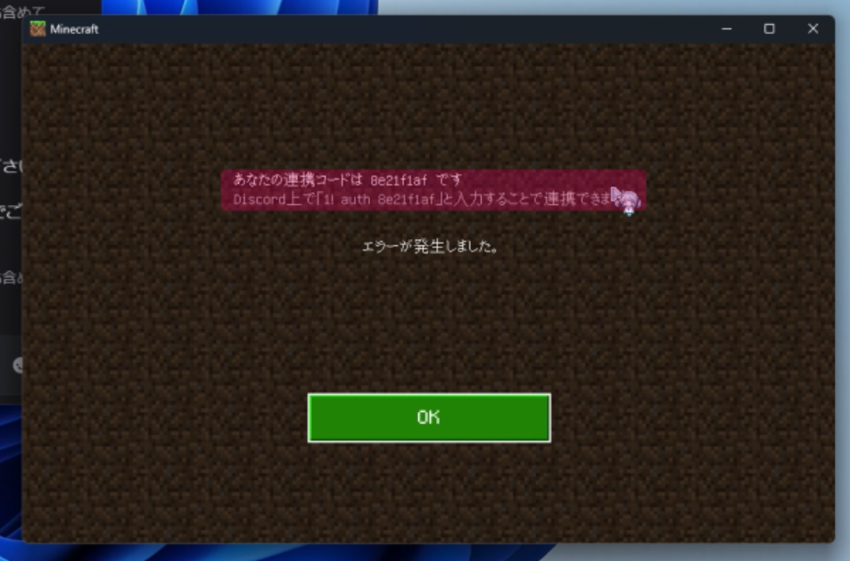
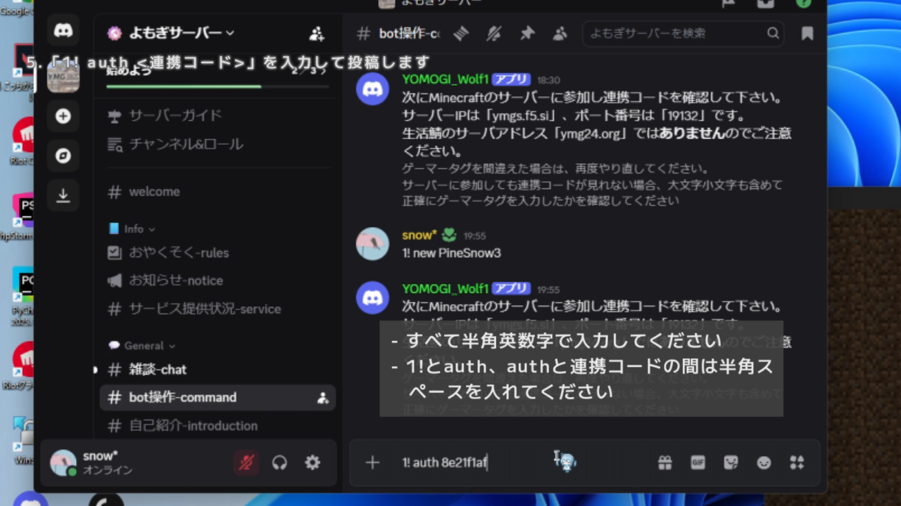
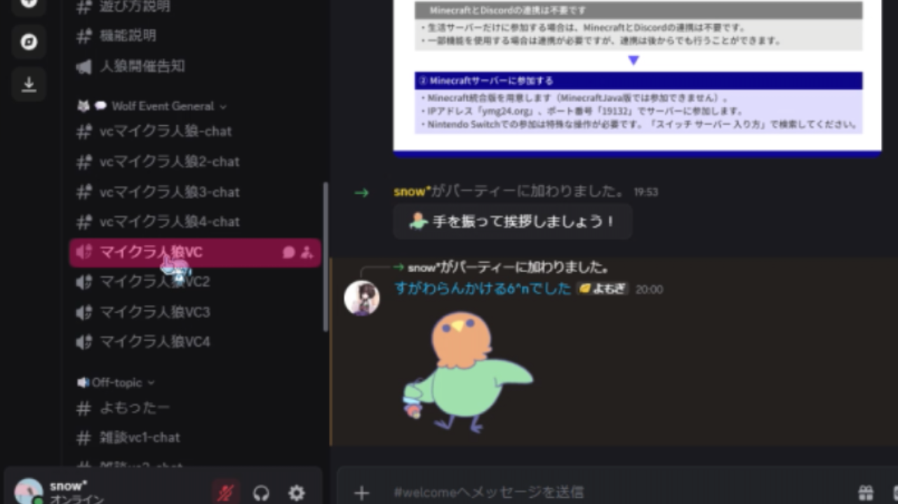

# マイクラ人狼イベントの参加方法

## 事前準備
よもぎサーバーで行われているマイクラ人狼イベントに参加するにはこれらが必要ですので、事前にご準備をお願いします。
 - Discordアカウント
 - Minecraft**統合版**(Java版不可/Switchは条件を満たせば参加可能)

「Discord」とは主にゲーマー向けに作られたオンラインのチャット・音声通話アプリです。基本的な機能は全て無料で利用できます。

:::caution 注意
毎週土曜日21:30から定期開催されているイベントに参加するには、以下の条件をすべて満たす必要があります
 - Minecraft統合版を保有していること
 - 13歳以上であり、Discordアカウントを保有していること
 - 人狼参加時にMinecraftを起動しながらDiscordのVCに参加できること(VCは聞き専可/MinecraftとDiscordは別端末でも構いません)
 - イベントに途中(21:37以降)から参加される場合は、本サイトなどでルールを学習済みであること
:::

:::info ご案内
本イベントは、開始時にルール説明を行いますので、イベントに21:30から参加される場合に限りルールを学習していなくても参加できます。
その場合でも、本ページの内容に従い、事前に連携操作をお済ませいただくとスムーズです。  
:::

## 参加の流れ

イベント参加にかかる流れの概要は以下の通りです。本ページで詳しく解説します。  
➀ よもぎサーバーのDiscordに参加する  
② Discord内でよもぎサーバーの利用規約に同意する  
③ MinecraftとDiscordアカウントを連携する  
④ 21:30に指定のVCに参加する  

### ① よもぎサーバーのDiscordに参加する

[こちらのDiscordサーバー招待ページ](https://discord.gg/5Ck73dDgHs)からよもぎサーバーのDiscordに参加します。  
参加時に「あなたはこのサーバーでなにをしたいですか？」と訪ねられた場合、「マイクラ人狼イベント(統合版限定)」を選択してください。  
なお、[生活サーバー](https://docs.ymg24.org/docs/category/%E7%94%9F%E6%B4%BB%E3%82%B5%E3%83%BC%E3%83%90%E3%83%BC)でも遊ぶ予定がある場合は「生活サーバー(統合版限定)」も併せて選択してください。  

### ② 利用規約に同意する

1. Discordの #おやくそく-rules チャンネルに移動します
2. ✅ボタンを押して[利用規約](https://docs.ymg24.org/docs/category/%E5%88%A9%E7%94%A8%E8%A6%8F%E7%B4%84)に同意します。

利用規約に同意しない場合、人狼用のVCに参加できません。
✅ボタンを押すことで、Discord上の全てのチャンネルが閲覧できるようになります。

### ③ MinecraftとDiscordを連携する
あなたが持っているMinecraftアカウントとDiscordアカウントを連携します。  
人狼サーバーに参加するためには必ずこの操作が必要です。

:::note
よもぎ鯖のマイクラ人狼イベントと生活サーバーでは共通の連携データを利用しています  
あなたが生活サーバーの一部機能を利用した際に、ここでの連携データが利用されることがあります
:::

1. Discordの #bot操作-command チャンネルに移動します
:::caution 注意
参加準備は順番通りに行ってください。②の利用規約への同意を行わないと、このチャンネルには移動できません
:::
2. 「1! new &lt;あなたのMinecraftゲーマータグ&gt;」とチャットします
:::caution 注意
 - 1!とnewとゲーマータグの間に、それぞれ半角スペースが必要です
 - ゲーマータグは、大文字と小文字を区別して正確に入力してください
:::

3. Minecraftでイベント用サーバーに接続して連携コードを確認します  
イベント用サーバーへの接続方法は複数あります。下記のいずれの方法でも連携コードを確認できます。

4. サーバーへの接続が成功すると画面に連携コードが表示されるので、メモします

:::caution 注意
- 連携コードが見れない場合は、[こちらのよくある質問のページ](https://docs.ymg24.org/docs/wolf/faq)をご覧ください
:::

5. Discordに戻り「1! auth &lt;連携コード&gt;」と入力します

:::caution 注意
- 1!とauthと連携コードの間に、それぞれ半角スペースが必要です
- 連携コードは、半角数字か半角英語の小文字です。数字のゼロ(0)とイチ(1)はありますが、アルファベットのエル(l)とオー(o)はありません
- 連携コードを忘れた場合は、再度マインクラフトサーバーに参加することで確認できます
:::

6. 「XXXと連携しました！ご協力ありがとうございました。」とのメッセージが送信されれば連携完了です

### ④ 21:30に指定のVCに参加する
イベント開始時刻になったら、Discordの #マイクラ人狼VC に参加します。  
  
主催者がMinecraftサーバーに参加するようご案内します。  

:::info 主催者がいない深夜帯に途中参加する場合
➀ 本サイトをご覧になり、事前にルールの把握をお願いします  
② VC参加後は、連携時に使用したMinecraftサーバーに接続するとイベントに参加できます  
:::