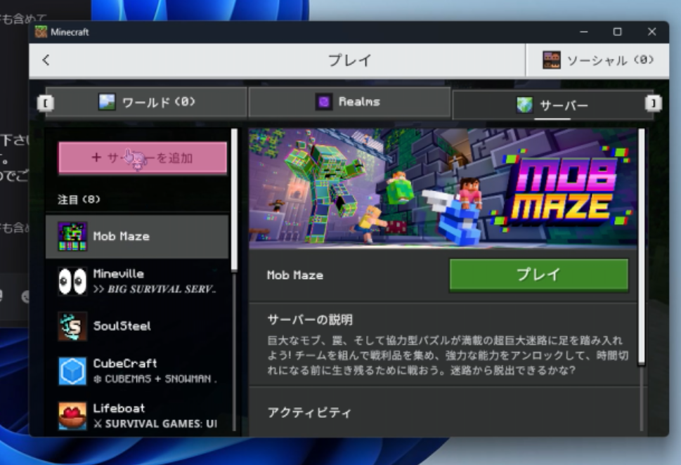
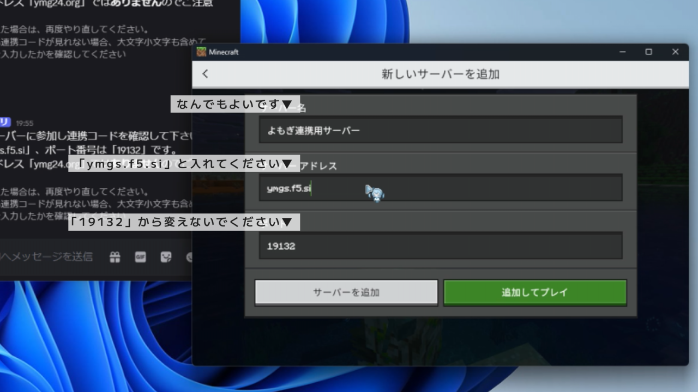

# サーバーアドレスを入力してサーバーに接続する

サーバーアドレスを入力することによるマイクラ人狼イベント用サーバーの接続方法について説明します。  
連携コードを確認する際とイベントに参加する際にこの操作が必要です。なお、イベント中はDiscordのVCにも参加する必要があります。

:::tip このページの要約
サーバーアドレスは「ymgs.f5.si」、ポートは「19132」です。
:::

:::info この方法のメリット
 - イベント用サーバーに直接アクセスするため、ポータルサーバーが停止していても接続できます
 - 経由するサーバーの数が少ないため、接続が安定しやすいです
 - スマートフォンやWindows PCから接続する際は、この方法が最速です
:::

:::caution この方法のデメリット
- Nintendo Switchで接続する際は、少々特殊な操作が必要になります
- マイクラ人狼イベントと生活サーバーの両方に参加される場合は、それぞれでサーバーアドレスの入力が必要になります
:::

## Minecraftサーバーに接続する

➀ Minecraftの統合版を起動し、「プレイ」をクリックします  
②「サーバー」をクリックします  
③ 画面左上の「サーバーを追加」をクリックします

:::caution 注意
Nintendo Switchの方は「サーバーを追加」ボタンがありません。  
サーバーの追加方法については https://docs.ymg24.org/docs/wolf/faq をご覧ください。
  :::

④ サーバー名に好きなサーバー名を、サーバーアドレスに「ymg24.org」、ポートに「19132」と入力してください。  

⑤ 「追加してプレイ」をクリックします  
⑥ サーバーに接続できます　　

:::caution 注意
サーバーに接続できない場合は https://docs.ymg24.org/docs/wolf/faq/joining-faults をご覧ください。
  :::