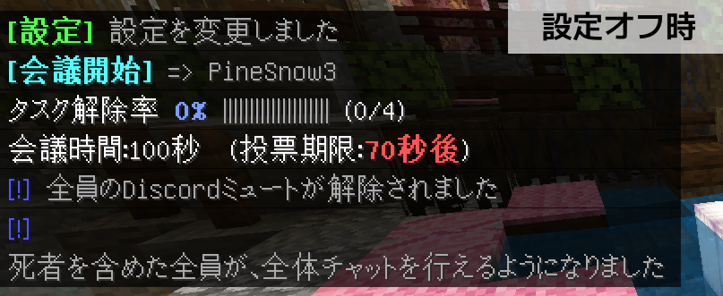
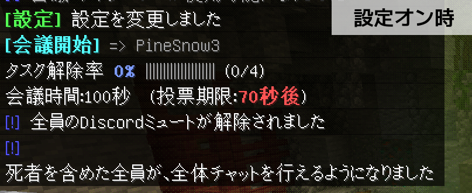
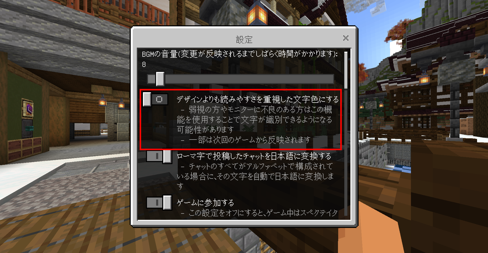
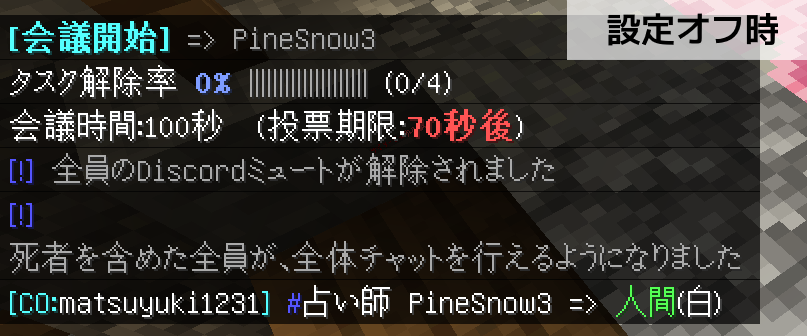
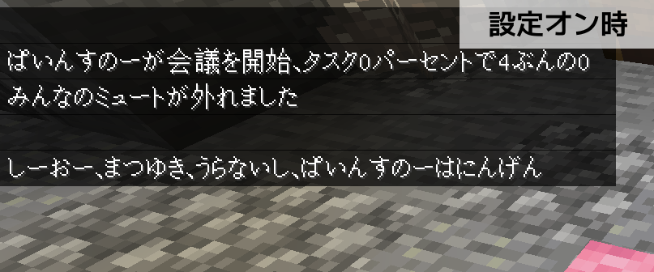
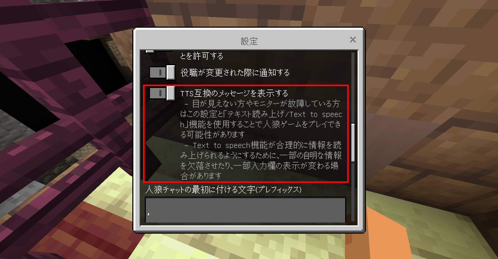
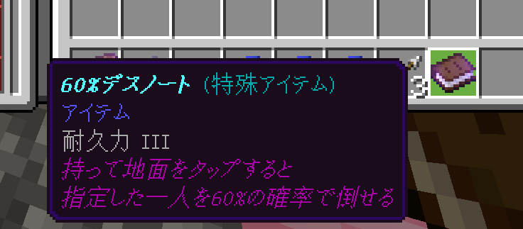
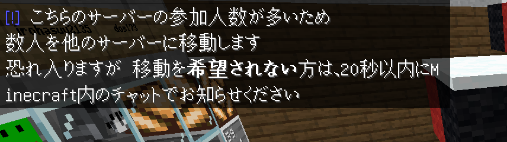
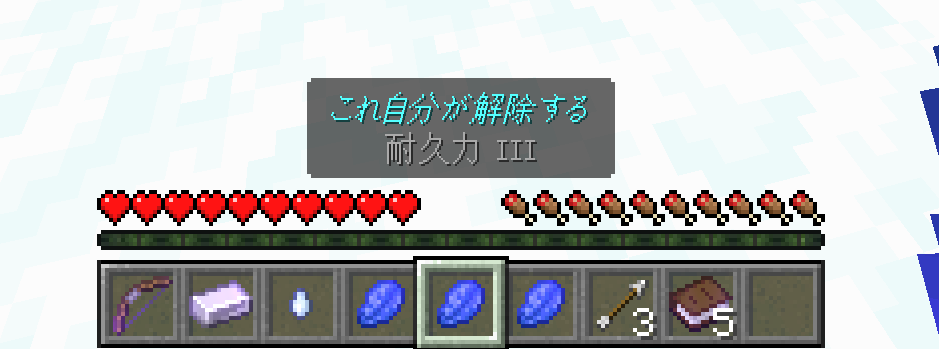

# アクセシビリティと配慮

障害者による情報の取得及び利用並びに意思疎通に係る施策の推進に関する法律の第五条には
> 事業者は、その事業活動を行うに当たっては、障害者がその必要とする情報を十分に取得し及び利用し並びに円滑に意思疎通を図ることができるようにするよう努めるとともに、国又は地方公共団体が実施する障害者による情報の取得及び利用並びに意思疎通に係る施策に協力するよう努めなければならない。

と定められています。よもぎサーバーのマイクラ人狼イベントは営利を目的としたものではないため事業者には当たらないと考えていますが、より多くの人がイベントにアクセスできるよう、可能かつ合理的な範囲でアクセシビリティの確保に努めています。  
このページではその参考として、身体障害を持った方がイベントに参加する際に利用しうる機能および配慮を列挙します。  
なお、このページに記載された事項はマイクラ人狼イベントのみを対象としたものであり、生活サーバーおよびその他のサービスはこのページの範囲外です。  
また、このページは全ての方がイベントにアクセスできることを保証するものではありません。

# 視覚サポート

## コントラストの増加

マイクラ人狼イベント内で提供されている一部のテキストは、背景色とのコントラストが十分に保たれていない色を使用しており、モニターのコントラストが低い方、夜間モードをオンにしている方、弱視の方の視認が難しくなっています。  
この対策として、チャットのコントラストを強め、読みやすい文字色を設定することができる機能を設けています。

この機能を利用するには、マイクラ人狼イベントのサーバー内にて/settingコマンドを実行し、「デザインよりも読みやすさを重視した文字色にする」をオンにします。

## TTS互換のメッセージを表示する

モニターが故障していたり視覚障害のある方はマインクラフトをプレイする際にテキスト読み上げ機能(またはText to speech機能/TTS機能とも呼ばれる)を使用します。  
この機能の使用によりマインクラフトのチャットを音声で読み上げることができますが、マイクラ人狼イベントでは標準で表示されるテキスト量が多く、読み上げ性能の限界を超過しています。  
また、役職名やプレイヤー名は一般に使用されていない読みをするものも多く、テキスト読み上げ機能が発音を誤ってしまう問題もあります。  
この対策として、表示する情報を最小限にとどめ、かつ必要に応じてふりがなをチャットに表示する機能を設けています。

この機能を利用するには、マイクラ人狼イベントのサーバー内にて/setting(すらっしゅ、えす、えす、てぃー、てぃー、あい、えぬ、じー)コマンドを実行し、「TTS互換のメッセージを表示する」をオンにします。
なお、2026年3月12日時点で、この設定項目は上から12番目、トグルの11番目にあります。

## デスノートの配布

モニターが故障している方や視覚障害のある方は弓や狙撃銃を用いて相手を攻撃することが非常に困難です。  
この対策として、本人が配慮を希望しており、かつ配慮を行うことが合理的であると運営が判断した人に対して、90秒に1回「60%デスノート」の配布を行っています。  

このデスノートを手に持って右クリックないしはタップ操作をおこなうと、専用の画面が開き、その画面で倒す対象を選択することで、60%でその対象を倒すことができます。  
なお、この機能を利用する場合、弓は使用できません。  

この機能の利用を希望する方は、Ticketなどを通じて運営までご連絡ください。その際、故障したモニターの画像や身体障害者手帳の画像の提出を要求する場合があります。

## 連携のサポート

本サイトの内マイクラ人狼について解説したページは全てテキストベースの情報を掲載していますが、それでもMinecraftとDiscordの連携作業を行うことは、記号やゲーマータグを正確に入力することが求められているために困難です。  
この対策として、本人が配慮を希望しており、かつ配慮を行うことが合理的であると運営が判断した人に対して、運営が手動で連携データを追加します。  

サポートを希望する方は、Ticketなどを通じて運営までご連絡ください。その際、自身のゲーマータグが証明できるスクリーンショットなどの提出を要求する場合があります。

# 聴覚サポート

## 補助放送の代替テキスト

マイクラ人狼イベントでは、主催者が発話できない際でも参加者に音声で情報を共有するために、録音された音声による補助放送を流すことがあります。  
この放送はDiscordのVC上で流れるものですが、音声が聞き取れない方に向けて、その代替テキストをマインクラフトサーバー内のチャットで表示しています。

## ルール説明のテキスト化

マイクラ人狼イベントでは、イベント開始時に主催者がルールをVCで説明することがあります。  
この説明に対する直接の代替テキストは提供されませんが、説明するルールは全て本ドキュメントサイトでテキスト化されており、これらのページを閲覧することで全てのルールを理解することができます。

## 情報のテキスト集約性

マイクラ人狼イベントでは原則として情報をテキストベースで表示するようにしています。  
補助的な役割としてイベント内で効果音を流すことはありますが、その際はテキストによる案内も併せて行っており、効果音を認識できないことで直ちにゲームプレイ上不利になることはありません。

:::caution VCの非サポート
マイクラ人狼イベントでは、VCによる対話を基本としています。VCはDiscordとよばれる外部のサービスを利用しているため、VC内で話されている内容についてよもぎサーバーから提供する代替テキストはありません。  
GoogleChromeの「自動字幕起こし」機能などをご利用ください。
:::

# 操作サポート

## デスノートの配布

上肢障害のある方は弓や狙撃銃を用いて相手を攻撃することが非常に困難です。  
この対策として、本人が配慮を希望しており、かつ配慮を行うことが合理的であると運営が判断した人に対して、90秒に1回「60%デスノート」の配布を行っています。  
「60%デスノート」は操作に時間がかかる方、2つ以上のキーまたはキーボードとマウスを同時に操作できない方でも使用できます。

このデスノートを手に持って右クリックないしはタップ操作をおこなうと、専用の画面が開き、その画面で倒す対象を選択することで、60%でその対象を倒すことができます。  
なお、この機能を利用する場合、弓は使用できません。

この機能の利用を希望する方は、Ticketなどを通じて運営までご連絡ください。その際、身体障害者手帳の画像の提出を要求する場合があります。

## 連携のサポート

本サイトの内マイクラ人狼について解説したページは全てテキストベースの情報を掲載していますが、それでもMinecraftとDiscordの連携作業を行うことは、記号やゲーマータグを正確に入力することが求められているために困難です。  
この対策として、本人が配慮を希望しており、かつ配慮を行うことが合理的であると運営が判断した人に対して、運営が手動で連携データを追加します。

サポートを希望する方は、Ticketなどを通じて運営までご連絡ください。VCによる対話での案内も可能です。データ追加の際、自身のゲーマータグが証明できるスクリーンショットなどの提出を要求する場合があります。

# 発話サポート

マイクラ人狼イベントでは理由の如何にかかわらず、マイクをオンにせずにイベントに参加する(聞き専)行為を認めています。  
障害を持っていなくとも何かしらの理由により聞き専を選択する方は多くおられ、主催者の体感では6割程度の人が聞き専です。  
聞き専の参加者はマイノリティではないため直ちに不利益をこうむることはありませんが、発話が可能なプレイヤーに比べ情報伝達速度に差が生じてしまうため、ゲームプレイ上不利になる可能性があります。

## 定型文

発話できない方が速やかに意思表示を行えるようにするために、ゲーム中はインベントリ内に3種類の定型文チャットアイテム(ラピスラズリ)が追加されています。  
これらのラピスラズリを手に持って右クリックないしはタップ操作をおこなうと、その内容を速やかにチャットすることができます。  

なお、定型文は自分の好みの文に設定することもできます。詳しくは[こちらの定型文について解説したページ](https://docs.ymg24.org/docs/wolf/fixed_text )をご覧ください。
